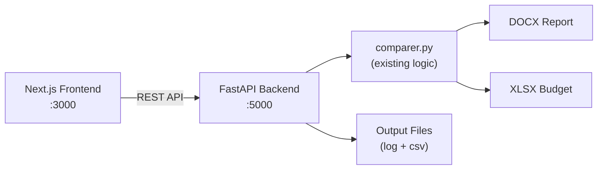

# Walkthrough – TM Comparador (Next.js + FastAPI)

## What Was Built

Migrated the **TM Comparador** from a Tkinter desktop app to a modern **Next.js + FastAPI** web application, maintaining design consistency with the existing "TM Relatorios" and "TM Pastas" projects.

## Architecture



## Files Created/Modified

| File | Action | Description |
|------|--------|-------------|
| [server.py](file:///c:/Users/thiag/TM-MEUS-APPS/TM%20Comparador/server.py) | **NEW** | FastAPI backend with 7 endpoints |
| [requirements.txt](file:///c:/Users/thiag/TM-MEUS-APPS/TM%20Comparador/requirements.txt) | **MOD** | Added fastapi, uvicorn, python-multipart |
| [run_app.bat](file:///c:/Users/thiag/TM-MEUS-APPS/TM%20Comparador/run_app.bat) | **MOD** | Launches both backend + frontend |
| [globals.css](file:///c:/Users/thiag/TM-MEUS-APPS/TM%20Comparador/frontend/app/globals.css) | **NEW** | Cyber Dark theme with glass panels, glow text |
| [layout.tsx](file:///c:/Users/thiag/TM-MEUS-APPS/TM%20Comparador/frontend/app/layout.tsx) | **NEW** | Root layout with Inter font |
| [page.tsx](file:///c:/Users/thiag/TM-MEUS-APPS/TM%20Comparador/frontend/app/page.tsx) | **NEW** | Main page composing all components |
| [useCompareStore.ts](file:///c:/Users/thiag/TM-MEUS-APPS/TM%20Comparador/frontend/stores/useCompareStore.ts) | **NEW** | Zustand store for state management |
| [Header.tsx](file:///c:/Users/thiag/TM-MEUS-APPS/TM%20Comparador/frontend/components/Header.tsx) | **NEW** | File selectors + action buttons |
| [SummaryPanel.tsx](file:///c:/Users/thiag/TM-MEUS-APPS/TM%20Comparador/frontend/components/SummaryPanel.tsx) | **NEW** | Stat cards for comparison summary |
| [ResultsTable.tsx](file:///c:/Users/thiag/TM-MEUS-APPS/TM%20Comparador/frontend/components/ResultsTable.tsx) | **NEW** | Sortable, filterable results table |
| [OutputBar.tsx](file:///c:/Users/thiag/TM-MEUS-APPS/TM%20Comparador/frontend/components/OutputBar.tsx) | **NEW** | Download buttons for logs/CSV |
| [ErrorBanner.tsx](file:///c:/Users/thiag/TM-MEUS-APPS/TM%20Comparador/frontend/components/ErrorBanner.tsx) | **NEW** | Dismissable error notifications |
| [EmptyState.tsx](file:///c:/Users/thiag/TM-MEUS-APPS/TM%20Comparador/frontend/components/EmptyState.tsx) | **NEW** | Animated placeholder before comparison |

## Design Decisions

- **Cyber Dark theme** from TM-Design-System: cyan primary `#00d4ff`, purple secondary `#7b2cbf`, amber accent `#ffab00`
- **Glass panels** and **glow effects** consistent with TM Relatorio's design language
- **Zustand** for lightweight state management (same as TM Pastas)
- **Framer Motion** animations for premium feel
- Backend reuses the **existing `comparer.py`** – zero logic duplication

## Verification

- ✅ `next build` completed with exit code 0
- ✅ All pages prerendered successfully as static content

## How to Run

Double-click **`run_app.bat`** or manually:

```bash
# Terminal 1 – Backend
.venv\Scripts\python server.py

# Terminal 2 – Frontend
cd frontend && npm run dev
```

Open **http://localhost:3000**
