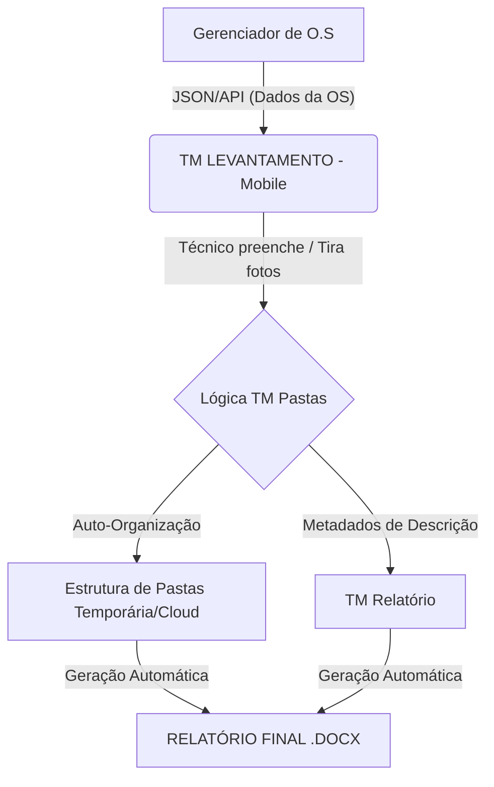

# Brainstorming: TM LEVANTAMENTO (SaaS Mobile Integration)

Este documento detalha a visão estratégica para o aplicativo **TM LEVANTAMENTO**, que servirá como a interface de campo unificada para o ecossistema TM.

## 🚀 O Insight Principal
Transformar o processo de levantamento técnico em uma jornada linear e automatizada:
1.  **Entrada:** Recebe dados do **Gerenciador de O.S.**
2.  **Operação:** Técnico realiza o levantamento em campo via Mobile.
3.  **Processamento:** O App organiza as fotos e dados seguindo a lógica do **TM Pastas**.
4.  **Saída:** Envio direto para o **TM Relatório** para geração do documento final (.docx).

---

## 🏗️ Arquitetura do Fluxo

---

## 📱 Funcionalidades Chave (Mobile Next.js)

### 1. Sincronização de O.S
*   Listagem de ordens de serviço pendentes.
*   Botão "Iniciar Levantamento" que pré-carrega dados do cliente e local.

### 2. Captura Inteligente (A-lá TM Pastas)
*   Interface intuitiva para selecionar o "Ambiente" ou "Tipo de Serviço".
*   Ao capturar a foto, o app já a nomeia internamente com o prefixo correto (Ex: `01.01_SALA_`).
*   Suporte a marcações de "Vista Ampla" e "Detalhes" em tempo real.

### 3. Descrições Dinâmicas "On-the-Go"
*   Seletor de descrições técnicas integradas (conforme o update GLB-11).
*   Campo para observações rápidas que serão injetadas no `{Desc_here}` do Word.

### 4. Integração de Saída
*   Geração de um "pacote de levantamento" (pode ser um ZIP estruturado ou envio via API).
*   Status de "Pronto para Relatório".

---

## 🎨 Design System (Inspirado no MAFFENG Dashboard)
*   **Modo:** Dark Mode (Otimizado para economia de bateria e visibilidade em campo).
*   **Cor Primária:** Verde TM (`#22c55e`) para simbolizar sucesso e operação.
*   **Layout:** Card-based modular. Cada card representa um item do levantamento.

---

## 🛠️ Roadmap de Desenvolvimento

### Fase 1: Setup & Mockup (Atual)
*   [x] Criação do repositório.
*   [ ] Desenvolvimento do Protótipo Funcional (Telas de Login, Dashboard de OS e Câmera).
*   [ ] Integração com o Design System Ocean Breeze.

### Fase 2: Lógica de Organização
*   [ ] Portar a função `folder_sort_key` do Python para JavaScript (Frontend).
*   [ ] Criar o engine de estruturação de arquivos virtuais.

### Fase 3: Conexão Final
*   [ ] Endpoint para enviar dados para o `server.py` do TM Relatório.

---

> [!IMPORTANT]
> **O Grande Diferencial:** Este aplicativo resolve o "gargalo" humano na organização de arquivos, eliminando a necessidade de renomear fotos manualmente no computador após o serviço. Todo o processamento de nomes e pastas ocorre em tempo real durante o levantamento.
