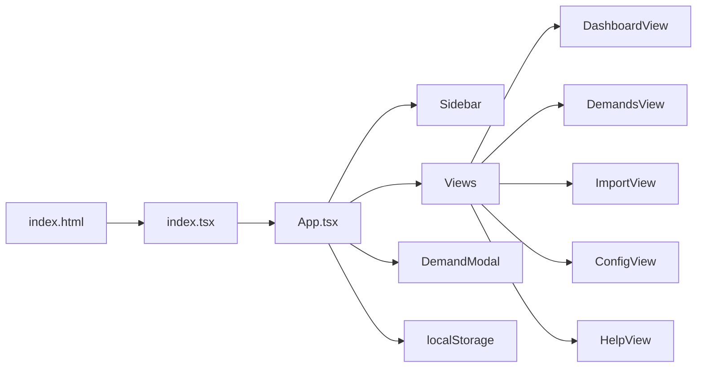

# Estado Atual do Repositório (TM - Sempre Tecnologia)

**Data da análise:** 2026-01-28
**Analisado por:** Agent Repo Analyst

---

## 1. Resumo Executivo

| Aspecto                                   | Descrição                                                                                                                                                                                             |
| ----------------------------------------- | ------------------------------------------------------------------------------------------------------------------------------------------------------------------------------------------------------- |
| **Objetivo percebido**              | Sistema de gestão de demandas e relatórios técnicos ("Acompanha Demanda Red") com precificação automática baseada em volume fotográfico                                                          |
| **O que já está pronto**          | Dashboard com métricas, listagem/CRUD de demandas, tabela de precificação configurável, checklist de 7 etapas por demanda, persistência em localStorage, interface completa com tema dark/vermelho |
| **O que está parcialmente pronto** | Importação de CSV (UI existe, mas handler não processa arquivos de fato)                                                                                                                             |
| **O que ainda não existe**         | Backend/API, banco de dados persistente, autenticação real, integração Google Sheets, exportação, testes automatizados, deploy configurado                                                        |

---

## 2. Como Este Repo Está Organizado

### 2.1 Visão Geral (Árvore)

```
acompanha-demanda-red/
├── Analises/                # Arquivos de análise (vazio)
├── docs/                    # Documentação (este arquivo)
├── node_modules/            # Dependências
├── .env.local               # Chave API Gemini (placeholder)
├── .gitignore               # Ignores padrão
├── App.tsx                  # Componente principal (~900 linhas)
├── constants.tsx            # Constantes: estágios, status, preços default
├── index.html               # Entry point HTML
├── index.tsx                # Entry point React
├── metadata.json            # Metadados do app (AI Studio)
├── package.json             # Dependências e scripts
├── package-lock.json        # Lock file
├── tsconfig.json            # Config TypeScript
├── types.ts                 # Interfaces TypeScript
├── utils.ts                 # Funções utilitárias
└── vite.config.ts           # Config Vite
```

### 2.2 Projetos/Módulos Identificados

#### (A) Módulo Principal - Acompanha Demanda

| Item                       | Descrição                                                               |
| -------------------------- | ------------------------------------------------------------------------- |
| **Caminho**          | Raiz do repositório                                                      |
| **Stack**            | React 19, TypeScript, Vite, TailwindCSS (via CDN), Recharts, Lucide React |
| **Responsabilidade** | Gestão completa de demandas técnicas com precificação automática     |
| **Entradas**         | Dados manuais via formulários, CSV (parcialmente implementado)           |
| **Saídas**          | Dashboard visual, listagem de demandas, estimativas de valor              |
| **Como rodar**       | `npm install` → `npm run dev`                                        |

---

## 3. Arquitetura Atual (Baseada no Que Existe)

### 3.1 Fluxo Principal



### 3.2 Componentes em `App.tsx`

| Componente        | Linhas  | Função                                    |
| ----------------- | ------- | ------------------------------------------- |
| `Sidebar`       | 28-89   | Navegação lateral fixa                    |
| `Badge`         | 91-103  | Badge reutilizável (good/warn/bad/neutral) |
| `App`           | 105-896 | Componente principal com estado global      |
| `DashboardView` | 194-323 | Cards de métricas + gráficos Recharts     |
| `DemandsView`   | 325-422 | Tabela de demandas com busca                |
| `ConfigView`    | 424-539 | Editor de tabela de preços                 |
| `DemandModal`   | 541-762 | Modal CRUD com checklist                    |
| `HelpView`      | 764-826 | Documentação MVP inline                   |
| `ImportView`    | 828-861 | UI de importação (não funcional)         |

### 3.3 Integrações

- **Gemini API**: Referenciada em `.env.local` e `vite.config.ts`, porém **não utilizada** no código atual
- **Recharts**: Gráficos de barras e pizza no Dashboard
- **Lucide React**: Ícones em toda a interface

### 3.4 Banco de Dados / Persistência

| Chave localStorage | Conteúdo                                     |
| ------------------ | --------------------------------------------- |
| `ad_demands`     | Array de demandas (`Demand[]`)              |
| `ad_pricing`     | Tabela de precificação (`PricingRule[]`)  |
| `ad_imports`     | Histórico de importações (`ImportLog[]`) |

> [!WARNING]
> Não existe banco de dados real. Todos os dados ficam no **localStorage do navegador** e serão perdidos ao limpar cache.

### 3.5 Autenticação/Autorização

**Não encontrado.** O sistema mostra "Admin" hardcoded na sidebar.

---

## 4. Setup e Execução (Confirmado no Código)

### 4.1 Requisitos

| Tecnologia | Versão                         |
| ---------- | ------------------------------- |
| Node.js    | Qualquer versão moderna (v18+) |
| npm        | Incluso no Node                 |

### 4.2 Variáveis de Ambiente

| Arquivo        | Variável          | Uso                                                      |
| -------------- | ------------------ | -------------------------------------------------------- |
| `.env.local` | `GEMINI_API_KEY` | Exposta via Vite, mas**não utilizada** no código |

### 4.3 Comandos

| Ação           | Comando                      |
| ---------------- | ---------------------------- |
| Instalação     | `npm install`              |
| Desenvolvimento  | `npm run dev` (porta 3000) |
| Build produção | `npm run build`            |
| Preview build    | `npm run preview`          |
| Testes           | **Não encontrado**    |
| Lint/format      | **Não encontrado**    |

---

## 5. Pontos de Atenção (Riscos e Dívidas)

> [!CAUTION]
> Itens críticos que precisam atenção antes de produção.

1. **Arquivo monolítico**: `App.tsx` tem 897 linhas com 8+ componentes inline. Dificulta manutenção e testes.
2. **Dados em localStorage**: Sem backend = dados perdidos ao limpar navegador.
3. **Importação não funcional**: `ImportView` tem UI, mas `<input type="file">` não processa os arquivos.
4. **TailwindCSS via CDN**: Carregado de `cdn.tailwindcss.com` no HTML. Não é recomendado para produção.
5. **Gemini API configurada mas não usada**: Variável exposta, mas nenhuma integração real.
6. **Bibliotecas via import map no HTML**: Usa `esm.sh` para React/Recharts no HTML, duplicando dependências do `package.json`.
7. **Sem ESLint/Prettier**: Nenhuma configuração de linting ou formatação encontrada.
8. **Sem testes**: Nenhum diretório `tests/`, `__tests__/`, ou configuração de testing.
9. **Ausência de CI/CD**: Sem `.github/workflows/` ou configs de deploy.
10. **Sem Docker**: Nenhum `Dockerfile` ou `docker-compose.yml`.

---

## 6. Gaps (O Que Faltou para Ficar "Redondo")

| Área                       | Gap                                                                 |
| --------------------------- | ------------------------------------------------------------------- |
| **Documentação**    | README básico, sem CHANGELOG, CONTRIBUTING, ou guia de arquitetura |
| **Testes**            | Zero cobertura de testes                                            |
| **Padronização**    | Sem ESLint, Prettier, ou convenções definidas                     |
| **Deploy**            | Sem configuração para Vercel, Netlify, ou similar                 |
| **Backend**           | Sem API para persistência real                                     |
| **Componentização** | Tudo em um arquivo - precisa refatorar para estrutura modular       |

---

--

## Anexos

### A. Dependências do `package.json`

**Produção:**

- `react@^19.2.3`
- `react-dom@^19.2.3`
- `lucide-react@^0.562.0`
- `recharts@^3.7.0`

**Desenvolvimento:**

- `@types/node@^22.14.0`
- `@vitejs/plugin-react@^5.0.0`
- `typescript@~5.8.2`
- `vite@^6.2.0`

### B. Interfaces Principais (`types.ts`)

```typescript
interface Demand {
  id: string;
  estado: string;
  contrato: string;
  chamado: string;
  prefixo: string;
  agencia: string;
  status: string;
  fotos: number | null;
  obs: string;
  vencPortal: string;
  envioCorrecao: string;
  envioOrcamento: string;
  stages: Record<string, boolean>;
  history: HistoryEntry[];
}

interface PricingRule {
  min: number;
  max: number;
  value: number;
}
```

### C. Estágios do Relatório (`constants.tsx`)

1. Organização Fotográfica
2. Formatação Documental
3. Identificação de Elementos
4. Anotação Dimensional
5. Descrição Técnica
6. Memorial de Cálculo
7. Memorial de Itens
