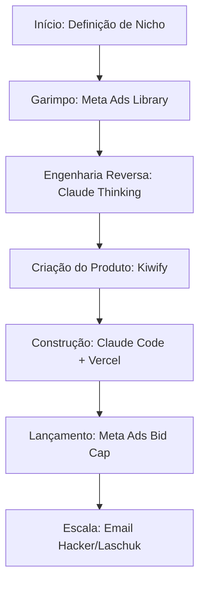

# 🚀 Guia Mestre: Monetização com I.A & Tráfego de Elite

Este guia é o seu roteiro passo a passo para sair do zero e subir sua primeira oferta global utilizando o "Método Franklim" de velocidade, o "Método Laschuk" de independência e a "Base Alex Vargas" de marketing digital.

---

## 🗺️ 1. O Diagrama de Guerra (Workflow)

---

## 📚 2. Conceitos Básicos Aplicados (Dicionário de Tráfego)

Para você que não sabe nada, aqui estão os termos que você vai usar todo dia:

*   **Low Ticket:** Produtos baratos (R$ 9,90 a R$ 47,00) vendidos por impulso.
*   **MVP (Mínimo Produto Viável):** Lançar a oferta rápido para testar, sem buscar a perfeição.
*   **CBO (Campaign Budget Optimization):** O Facebook decide em qual anúncio gastar o seu dinheiro para te dar mais lucro.
*   **Bid Cap (Limite de Lance):** Você trava o valor máximo que aceita pagar por uma venda. Se o Facebook não achar venda barata, ele não gasta seu dinheiro.
*   **LATAM/Global:** Vender para países de língua espanhola (México, Colômbia, Argentina). Menos concorrência que o Brasil.
*   **Tráfego Próprio (Laschuk):** Construir uma lista de e-mails para vender várias vezes para a mesma pessoa sem pagar anúncios de novo.

---

## 🛠️ 3. Passo a Passo: Do Zero ao Primeiro Anúncio

### Passo 1: O Garimpo (Mineração)
1.  Acesse a [Biblioteca de Anúncios](https://www.facebook.com/ads/library/).
2.  Pesquise termos como: "Apenas R$ 19", "Oferta por tempo limitado", "Pack de atividades".
3.  **Dica do Franklim:** Ache anúncios que estão rodando há mais de 7 dias (isso significa que estão dando lucro).

### Passo 2: Engenharia Reversa com I.A
1.  Copie o link ou o texto da página de vendas do concorrente.
2.  Cole no Claude com o prompt: *"Analise esta oferta, melhore a promessa e crie uma estrutura de página de vendas para o mercado LATAM (Espanhol)."*

### Passo 3: Criação Automática (Claude Code)
1.  Use a extensão **Claude Code** no VS Code.
2.  Peça para ele gerar o `index.html` usando **Tailwind CSS** (design moderno e rápido).
3.  Gere as imagens dos produtos no **Grok** ou **Leonardo.ai**.

### Passo 4: Hospedagem Grátis (Vercel)
1.  Suba seus arquivos para o **GitHub**.
2.  Conecte na **Vercel** para ter um link `.vercel.app` gratuito e profissional.

### Passo 5: O Setup do Meta Ads (Bid Cap)
*   **Campanha:** Vendas / CBO Ativado.
*   **Orçamento:** 2x o valor do seu produto.
*   **Lance (Bid Cap):** 50% do valor do seu produto.
*   **Público:** Aberto (Apenas defina o país: México, por exemplo).

---

## 🔗 4. Links Úteis e Ferramentas

| Ferramenta | Utilidade | Link |
| :--- | :--- | :--- |
| **Meta Ads Library** | Espionagem de ofertas | [Acessar](https://www.facebook.com/ads/library/) |
| **Super Design** | Prompts de Landing Pages | [Acessar](https://superdesign.to/) |
| **Vercel** | Hospedagem 100% Grátis | [Acessar](https://vercel.com/) |
| **Kiwify** | Checkout e Pagamentos | [Acessar](https://kiwify.com.br/) |
| **Pollinations/Grok** | Geração de Imagens I.A | [Acessar](https://pollinations.ai/) |

---

## 💡 5. A Mentalidade Laschuk (Pós-Venda)
Não pare na primeira venda. O segredo da riqueza no digital é o **LTV (Lifetime Value)**.
*   Capture o e-mail de todo comprador.
*   Envie ofertas semanais via E-mail Marketing.
*   **Regra:** O anúncio paga o custo de aquisição; o e-mail gera o lucro real.

---
*Documento gerado por Antigravity - Sincronizado com os arquivos de Monetização com I.A*
