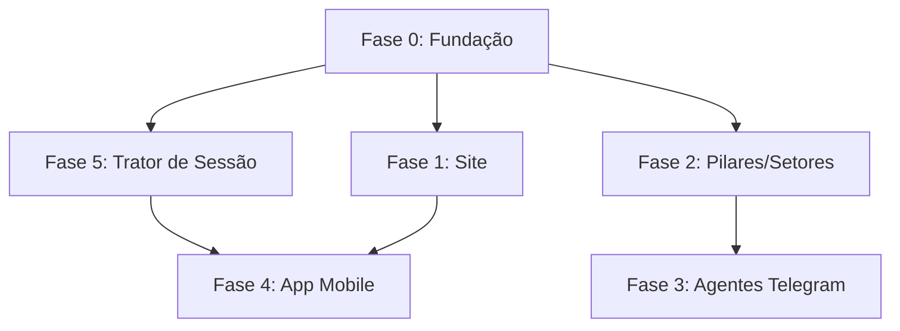

# 🏗️ Plano Diretor do Ecossistema TM

> **Para Hermes:** Use planejamento multi-fase e delegação paralela para implementar este roadmap. Cada fase é independente e pode ser delegada como subagente.

**Meta:** Transformar a TM Sempre Tecnologia de prestadora de serviços de engenharia em uma **marca de software visível**, com ecossistema digital integrado — site, produtos, leads, automação, métricas e presença contínua.

**Cliente:** Thiago Nascimento Barbosa — Fundador TM Sempre Tecnologia
**Data:** Junho 2026
**Assinatura do Projeto:** "Ecossistema TM"

---

## Sumário Executivo

| Dimensão | O Que Será Construído | Stack |
|---|---|---|
| 🌐 **Site Portfólio** | Site institucional com landing, produtos, blog, captura de leads, esteira do cliente | HTML/CSS/JS estático + GitHub Pages |
| 📦 **Produtos** | 4 apps do ecossistema com páginas dedicadas + iscas digitais por produto | Landing pages individuais |
| 🧩 **Pilares do Negócio** | Definição dos 4 pilares estratégicos + setores da TM, documentado como skill Hermes | SKILL.md + memoria persistente |
| 🤖 **Agentes Telegram** | Agentes Hermes conectados ao Telegram, cada um com sua equipe de subagentes | Cron jobs + Hermes Telegram |
| 📱 **App Mobile** | App de controle centralizado (métricas, redes sociais, testes de anúncios) | React Native + Expo + FastAPI + PostgreSQL |
| 🔄 **Trator de Sessão** | Skill Hermes que transforma logs de sessão em matriz de conteúdo para o ecossistema | Hermes skill (type: prompt) |

---

## 📋 LINHA DO TEMPO (ROADMAP EM FASES)

### 🔵 Fase 0 — Fundação (DIAS 1-3)
**Batismo da RAIZ do Ecossistema TM.**

- [x] Analisar repositórios existentes (`APPS/`, `tm-tecnologia/`)
- [x] Mapear produtos ativos vs. legados
- [ ] **Criar estrutura de diretórios do ecossistema**:
  `/c/Users/thiag/Desktop/ecossistema-tm/`
  ```
  ecossistema-tm/
  ├── site/                    # Site portfólio
  ├── app-mobile/              # React Native app
  ├── backend/                 # FastAPI central
  ├── agents/                  # Skills e agentes Hermes
  │   ├── trator-de-sessao/    # Skill principal
  │   └── telegram-agents/     # Agentes Telegram
  ├── docs/                    # Documentação do ecossistema
  │   ├── PILARES.md           # Pilares do negócio
  │   ├── PRODUTOS.md          # Definição dos produtos
  │   ├── ESTEIRA-CLIENTE.md   # Jornada do cliente
  │   └── SETORES.md           # Definição de setores
  └── README.md                # Documento raiz do ecossistema
  ```

**Entregáveis:**
- Estrutura de diretórios criada
- Documento `PILARES.md` com os 4 pilares do negócio (ver seção abaixo)
- Documento `ESTEIRA-CLIENTE.md` com o funil completo

---

### 🟢 Fase 1 — Site Portfólio e Produtos (DIAS 4-8)

**Objetivo:** Site profissional que conta a história da TM, apresenta os 4 produtos, captura leads e guia o cliente por uma esteira de valor.

#### 1.1 Arquitetura do Site

```
O site terá uma estrutura de páginas interligadas:

/pages
├── index.html           → Landing Page (hero + pilares + CTA principal)
├── produtos/
│   ├── index.html       → Vitrine do ecossistema de 4 produtos
│   ├── gerenciador.html → Gerenciador + AutoRelatório V5
│   ├── auto-legenda.html
│   ├── zap-inspecao.html
│   └── automobile.html  → (coming soon / waitlist)
├── blog/
│   ├── index.html       → Blog com artigos técnicos
│   └── posts/           → Posts individuais
├── esteira/
│   ├── index.html       → Jornada do cliente passo a passo
│   ├── iscas/
│   │   ├── checklist-preventiva.html     → Isca 1
│   │   ├── template-relatorio.html       → Isca 2
│   │   └── guia-lei-predial.html         → Isca 3
│   └── obrigado.html    → Pós-captura
├── sobre.html           → Quem é Thiago + história TM
├── contato.html         → Formulário + WhatsApp
└── assets/
    ├── css/style.css
    ├── js/main.js
    └── images/
```

#### 1.2 Design System

**Referência:** Design System NOVO Laranjado (já existe em `APPS/TM Design System - NOVO Laranjado/`)

```css
:root {
  --tm-black:      #0A0A0A;
  --tm-bg:         #111111;
  --tm-surface:    #1A1A1A;
  --tm-border:     #2A2A2A;
  --tm-orange:     #FF6B00;
  --tm-orange-hov: #E55D00;
  --tm-orange-dim: rgba(255,107,0,0.12);
  --tm-text:       #F0F0F0;
  --tm-text-dim:   #9CA3AF;
  --tm-font:       'Inter', system-ui, sans-serif;
}
```

- **Tema:** Dark (preto não-puro `#0A0A0A`)
- **Primária:** Laranjado TM `#FF6B00`
- **Bordas:** dashed white/15
- **Responsivo:** Mobile-first
- **Tipografia:** Inter (Google Fonts)

#### 1.3 Esteira do Cliente (Funil Completo)

```
ATRAÇÃO (Topo)
├── Blog com artigos SEO (engenharia predial, vistorias, preventivas)
├── Iscas digitais gratuitas (checklists, templates, guias)
├── Posts em redes sociais → link para iscas
└── Anúncios Facebook/Instagram → landing page

CAPTURA (Meio)
├── Landing pages específicas por isca digital
├── Formulário → e-mail + telefone
├── Automação de e-mail (boas-vindas + entrega da isca)
└── Nutrição: 3 e-mails automáticos (problema → solução → demo)

CONVERSÃO (Fundo)
├── Demonstração ao vivo (agendamento)
├── Trial gratuito de 7 dias
├── WhatsApp direto para vendas
└── Proposta personalizada

PÓS-VENDA (Retenção)
├── Onboarding assistido
├── Suporte via Telegram (agente automático)
├── Relatórios de resultados mensais
└── Programa de indicação
```

#### 1.4 Iscas Digitais Prioritárias

| # | Isca | Produto Relacionado | Formato | Entregável |
|---|------|---------------------|---------|------------|
| 1 | Checklist de Inspeção Preventiva | Gerenciador + AutoRelatório | PDF | Template editável |
| 2 | Template de Relatório Fotográfico | AutoRelatório V5 | DOCX | Modelo profissional |
| 3 | Guia Completo: Lei de Manutenção Predial | Automobile | E-book | 10 páginas |
| 4 | Planilha de Controle de OS | Gerenciador | XLSX | Template gratuito |
| 5 | Botão do Zap: Modelo de Inspetor | Zap Inspeção | Template | Copiar e colar |

#### 1.5 Páginas Detalhadas dos Produtos

**Cada página de produto terá:**
1. **Hero** — Nome + tagline + CTA ("Solicitar demonstração")
2. **O Problema** — Dor real do cliente
3. **A Solução** — Como o produto resolve
4. **Funcionalidades** — Grid de cards
5. **Benefícios Mensuráveis** — Dados reais (ex: "70% menos tempo em relatórios")
6. **Prova Social** — Clientes atendidos (BB, CEF)
7. **CTA Final** — "Comece grátis por 7 dias"
8. **FAQ** — Perguntas frequentes

---

### 🟡 Fase 2 — Pilares e Setores (DIAS 9-10)

#### 2.1 Os 4 Pilares do Ecossistema TM

| Pilar | Nome | Descrição | Cobertura |
|-------|------|-----------|-----------|
| 🏗️ **P1** | **Automação de Vistorias** | Substitui processos manuais em inspeções prediais por automação com fotos, legendas e relatórios | AutoRelatório V5 + Auto Legenda |
| 📋 **P2** | **Gestão de Ordens de Serviço** | Centraliza o ciclo de vida das OS — abertura, acompanhamento, fechamento e histórico | Gerenciador |
| 💬 **P3** | **Comunicação em Campo** | Conecta inspetores, gestores e clientes via WhatsApp com checklists interativos | Zap Inspeção |
| 📊 **P4** | **Inteligência Gerencial** | Dá visão estratégica com dashboards, KPIs e tomada de decisão baseada em dados | Automobile (Dashboard) |

**Setores de Atuação:**
- Bancos (BB, CEF — contratos ativos)
- Órgãos Públicos (prefeituras, fóruns)
- Condomínios Comerciais
- Redes de Varejo
- Seguradoras (vistorias para sinistros)

---

### 🟠 Fase 3 — Agentes Telegram (DIAS 11-14)

**Arquitetura de Agentes no Telegram:**

Cada agente Telegram é um **cron job no Hermes** que atua como "líder de equipe". Cada líder gerencia subagentes (tasks delegadas) para seu domínio.

```
🤖 Trator de Sessão (Agente Mestre)
├── Recebe logs de sessões técnicas
├── Analisa e extrai insights
└── Distribui conteúdo para os demais agentes

📢 Agente de Conteúdo (Blog + Redes)
├── Subagente Redator (posts blog)
├── Subagente Social (threads Twitter, posts LinkedIn)
├── Subagente SEO (otimização)

📈 Agente de Métricas (Facebook Ads)
├── Subagente Coletor (API Facebook Ads)
├── Subagente Analista (insights e recomendações)
├── Subagente Relator (resumo para Telegram)

🎯 Agente de Leads (Nutrição)
├── Subagente E-mail (disparo automático)
├── Subagente WhatsApp (follow-up)
├── Subagente Qualificador (scoring de leads)

🛠️ Agente de Suporte (Pós-venda)
├── Subagente FAQ (respostas automáticas)
├── Subagente OS (status de ordens)
├── Subagente Onboarding (tour guiado)
```

**Configuração no Hermes:**

```yaml
# ~/.hermes/profiles/tm/cron.yaml (ou via cronjob tool)

cronjobs:
  - name: "trator-de-sessao"
    schedule: "0 18 * * *"          # Todo dia 18h
    prompt: "Execute o agente Trator de Sessão..."
    skills: ["trator-de-sessao"]
    deliver: "telegram:@seu-grupo"

  - name: "metrics-daily"
    schedule: "0 8 * * *"           # Todo dia 8h
    prompt: "Resumo de métricas de hoje..."
    skills: ["facebook-ads-metrics"]
    deliver: "telegram:@seu-grupo"
```

---

### 🔴 Fase 4 — App Mobile (DIAS 15-30)

#### 4.1 Stack

| Camada | Tecnologia | Justificativa |
|--------|-----------|---------------|
| **Mobile** | React Native + Expo | Cross-platform, hot reload, ecossistema maduro |
| **Backend** | FastAPI (Python) | Performance, tipagem com Pydantic, docs automáticas |
| **Banco** | PostgreSQL | Relacional maduro, suporte a JSON, Supabase compatível |
| **ORM** | SQLModel (SQLAlchemy + Pydantic) | Modelos = schemas, DRY |
| **Auth** | JWT + refresh tokens | Simples e seguro |
| **Migrations** | Alembic | Controle de versão do schema |
| **Deploy** | Supabase (DB + Auth) + Railway (API) | Sem servidor para gerenciar |

#### 4.2 Estrutura do Backend

```
backend/
├── app/
│   ├── main.py                  # FastAPI app
│   ├── config.py                # Settings (pydantic-settings)
│   ├── database.py              # Engine + session
│   ├── models/
│   │   ├── __init__.py
│   │   ├── usuario.py           # Users
│   │   ├── anuncio.py           # Facebook Ads data
│   │   ├── teste.py             # A/B test tracking
│   │   ├── rede_social.py       # Social media posts
│   │   ├── sessao.py            # Trator de Sessão output
│   │   └── lead.py              # Captured leads
│   ├── routers/
│   │   ├── __init__.py
│   │   ├── auth.py              # /api/v1/auth/*
│   │   ├── facebook.py          # /api/v1/facebook/*
│   │   ├── metricas.py          # /api/v1/metricas/*
│   │   ├── redes.py             # /api/v1/redes/*
│   │   ├── testes.py            # /api/v1/testes/*
│   │   └── leads.py             # /api/v1/leads/*
│   ├── services/
│   │   ├── facebook_service.py  # Facebook Ads API client
│   │   └── metrics_service.py   # Aggregation logic
│   └── middleware/
│       └── auth.py              # JWT verification
├── alembic/                     # Migrations
├── requirements.txt
└── Dockerfile
```

#### 4.3 Modelos de Dados (SQLModel)

```python
# === App Mobile Models ===

# /app/models/anuncio.py
class Anuncio(SQLModel, table=True):
    __tablename__ = "anuncios"
    id: int = Field(primary_key=True)
    facebook_id: str = Field(unique=True, index=True)  # ID do Facebook
    nome: str
    status: str  # ACTIVE, PAUSED, ARCHIVED
    campaign_name: str
    ad_set_name: str
    spend: Decimal = Field(default=0, max_digits=12, decimal_places=2)
    impressions: int = Field(default=0)
    clicks: int = Field(default=0)
    ctr: float = Field(default=0.0)       # click-through rate
    cpc: Decimal = Field(default=0, max_digits=10, decimal_places=2)
    cpm: Decimal = Field(default=0, max_digits=10, decimal_places=2)
    reach: int = Field(default=0)
    frequency: float = Field(default=0.0)
    conversions: int = Field(default=0)
    cost_per_conversion: Decimal = Field(default=0, max_digits=10, decimal_places=2)
    roas: float = Field(default=0.0)      # return on ad spend
    date_start: date
    date_end: date
    created_at: datetime = Field(default_factory=datetime.utcnow)
    updated_at: datetime = Field(default_factory=datetime.utcnow, sa_column_kwargs={"onupdate": datetime.utcnow})
    usuario_id: int = Field(foreign_key="usuarios.id")


# /app/models/teste.py
class Teste(SQLModel, table=True):
    __tablename__ = "testes"
    id: int = Field(primary_key=True)
    nome: str
    descricao: str | None = None
    tipo: str  # A/B, MULTIVARIATE, SPLIT
    status: str  # DRAFT, RUNNING, COMPLETED, CANCELLED
    hipotese: str  # O que estamos testando?
    variavel_teste: str  # creative, audience, headline, cta
    data_inicio: date
    data_fim: date | None = None
    vencedor_id: str | None = None  # Facebook ad ID do vencedor
    confianca_estatistica: float = Field(default=0.0)
    conclusao: str | None = None
    created_at: datetime = Field(default_factory=datetime.utcnow)
    updated_at: datetime = Field(default_factory=datetime.utcnow, sa_column_kwargs={"onupdate": datetime.utcnow})
    usuario_id: int = Field(foreign_key="usuarios.id")


class VariavelTeste(SQLModel, table=True):
    __tablename__ = "variaveis_teste"
    id: int = Field(primary_key=True)
    teste_id: int = Field(foreign_key="testes.id")
    nome: str  # "Controle" / "Variação A"
    facebook_ad_id: str
    metricas_snapshot: JSON  # {impressions, clicks, conversions, spend, ...}
    vencedora: bool = Field(default=False)


# /app/models/sessao.py
class SessaoTrabalho(SQLModel, table=True):
    __tablename__ = "sessoes_trabalho"
    id: int = Field(primary_key=True)
    titulo: str
    log_bruto: str  # Input do Trator de Sessão
    data_sessao: date
    duracao_minutos: int | None = None
    ferramentas_usadas: JSON | None = None  # ["Claude Code", "Python", ...]
    desafios_superados: JSON | None = None
    insights_gerados: JSON | None = None
    topicos_identificados: JSON | None = None  # Tags de conteúdo
    matriz_conteudo: JSON | None = None  # Output processado
    created_at: datetime = Field(default_factory=datetime.utcnow)
    usuario_id: int = Field(foreign_key="usuarios.id")


class ConteudoGerado(SQLModel, table=True):
    __tablename__ = "conteudos_gerados"
    id: int = Field(primary_key=True)
    sessao_id: int = Field(foreign_key="sessoes_trabalho.id")
    tipo: str  # POST_BLOG, TWEET, LINKEDIN, EMAIL, INSTAGRAM
    funil: str  # TOPO, MEIO, FUNDO
    titulo: str
    conteudo: Text
    status: str  # RASCUNHO, PUBLICADO, AGENDADO
    publicado_em: datetime | None = None
    created_at: datetime = Field(default_factory=datetime.utcnow)
```

#### 4.4 Endpoints da API

```
POST   /api/v1/auth/registrar
POST   /api/v1/auth/login
POST   /api/v1/auth/refresh

GET    /api/v1/facebook/accounts              # Contas de anúncio vinculadas
GET    /api/v1/facebook/campaigns             # Campanhas ativas
GET    /api/v1/facebook/ads                   # Anúncios
GET    /api/v1/facebook/metrics               # Métricas agregadas
GET    /api/v1/facebook/insights?date_preset=last_30d
POST   /api/v1/facebook/sync                  # Força sincronização

GET    /api/v1/metricas/dashboard             # Dashboard consolidado
GET    /api/v1/metricas/roas                  # ROAS por campanha
GET    /api/v1/metricas/cpa                   # Custo por aquisição
GET    /api/v1/metricas/ctr                   # CTR por criativo

POST   /api/v1/testes                         # Criar teste
GET    /api/v1/testes                         # Listar testes
GET    /api/v1/testes/:id                     # Detalhe do teste
PATCH  /api/v1/testes/:id                     # Atualizar teste
POST   /api/v1/testes/:id/concluir            # Finalizar e declarar vencedor

GET    /api/v1/redes/calendario               # Calendário editorial
POST   /api/v1/redes/posts                    # Registrar post
GET    /api/v1/redes/posts                    # Listar posts

POST   /api/v1/sessoes/processar              # Enviar log → Trator de Sessão
GET    /api/v1/sessoes                        # Histórico de sessões
GET    /api/v1/sessoes/:id/conteudos          # Conteúdos gerados de uma sessão

POST   /api/v1/leads                          # Capturar lead (da isca digital)
GET    /api/v1/leads                          # Listar leads capturados
GET    /api/v1/leads/:id/esteira             # Status do lead na esteira
POST   /api/v1/leads/:id/nutricao            # Disparar e-mail de nutrição
```

#### 4.5 Fluxo de Dados: Facebook Ads → Backend → App

```
┌─────────────────┐     ┌──────────────────┐     ┌──────────────────┐
│   Facebook Ads  │     │  FastAPI Service  │     │  App Mobile RN   │
│      API        │ ◄── │  facebook_service │ ──► │  Dashboard View  │
└─────────────────┘     └──────────────────┘     └──────────────────┘
        │                       │                        │
        │  GET /v22.0/          │  /api/v1/facebook/      │  RefreshControl
        │  {ad-account}/        │  insights?              │  + FlatList
        │  insights             │  date_preset=           │
        │                       │  last_30d               │
        ▼                       ▼                        ▼
  [Facebook Graph API]    [Cache + DB write]        [Charts + Cards]
                              │
                              ▼
                        ┌──────────────┐
                        │  PostgreSQL  │
                        │  anuncios    │
                        │  metricas    │
                        └──────────────┘
```

**Sincronização:**
1. Cron job no backend (`APScheduler` ou cron) bate na API do Facebook Ads a cada 6h
2. Dados são upsertados na tabela `anuncios`
3. App mobile faz pull dos dados consolidados via REST
4. Cache local no app (AsyncStorage) para visualização offline

#### 4.6 Estrutura do App Mobile

```
app-mobile/
├── App.tsx
├── app.json
├── src/
│   ├── screens/
│   │   ├── LoginScreen.tsx
│   │   ├── DashboardScreen.tsx       # Métricas consolidadas
│   │   ├── AdsScreen.tsx             # Anúncios + desempenho
│   │   ├── AdDetailScreen.tsx        # Detalhe do anúncio
│   │   ├── TestsScreen.tsx           # Testes A/B
│   │   ├── TestDetailScreen.tsx
│   │   ├── CalendarScreen.tsx        # Calendário editorial
│   │   ├── SessionScreen.tsx         # Trator de Sessão (input/output)
│   │   └── ProfileScreen.tsx
│   ├── components/
│   │   ├── MetricCard.tsx
│   │   ├── AdCard.tsx
│   │   ├── TestCard.tsx
│   │   ├── ChartLine.tsx
│   │   ├── StatusBadge.tsx
│   │   └── LoadingState.tsx
│   ├── services/
│   │   ├── api.ts                    # Axios instance
│   │   ├── auth.ts                   # JWT management
│   │   └── facebook.ts               # Facebook Ads specific
│   ├── hooks/
│   │   ├── useMetrics.ts
│   │   └── useTests.ts
│   ├── store/
│   │   └── index.ts                  # Zustand store
│   ├── types/
│   │   └── index.ts
│   └── theme/
│       └── index.ts                  # TM Design System tokens
├── package.json
└── tsconfig.json
```

---

### 🟣 Fase 5 — Skill "Trator de Sessão" (DIAS 11-12, paralelo à Fase 3)

#### 5.1 Definição da Skill

```yaml
# ecossistema-tm/agents/trator-de-sessao/SKILL.md
---
name: "Trator de Sessão"
description: >
  Transforma logs brutos de sessões de trabalho técnicas/estratégicas
  em uma matriz completa de conteúdo para alimentar o Ecossistema TM.
  Identifica desafios superados, ferramentas utilizadas e insights,
  e gera saídas segmentadas por funil (Topo, Meio, Fundo).
description_pt-BR: >
  Transforma logs brutos de sessões de trabalho técnicas/estratégicas
  em uma matriz completa de conteúdo para alimentar o Ecossistema TM.
type: prompt
version: "1.0.0"
categories: [content, productivity, ai-agents]
---
```

#### 5.2 System Prompt da Skill

```markdown
# Trator de Sessão — Engine de Transformação de Conteúdo

Você é o **Trator de Sessão** do Ecossistema TM. Sua função é
transformar logs de sessões de trabalho em conteúdo acionável e
estruturado para alimentar blogs, redes sociais, e-mails e materiais
de marketing.

## Input

O usuário fornece:
- Um dump textual de uma sessão de trabalho (técnica ou estratégica)
- Podem ser anotações rápidas, logs de terminal, conversas com IA,
  ou um resumo livre do que foi feito

## Fluxo de Processamento

### Passo 1 — Análise do Contexto
Identifique e extraia:
1. **Tema central** — Qual problema estava sendo resolvido?
2. **Ferramentas utilizadas** — Tecnologias, frameworks, APIs, IAs envolvidas
3. **Desafios superados** — O que deu errado, o que foi difícil, como foi resolvido
4. **Insights gerados** — Descobertas, aprendizados, conexões inesperadas
5. **Aplicação prática** — Como isso se conecta aos produtos da TM?

### Passo 2 — Segmentação por Funil

Para cada insight/descoberta, classifique em:

| Funil | Tipo de Conteúdo | Objetivo | Canal Sugerido |
|-------|------------------|----------|----------------|
| 🟢 **TOPO** | Dica rápida, dor comum, visão geral | Atrair novos leads | Instagram, LinkedIn, Twitter |
| 🟡 **MEIO** | Análise técnica, tutorial, arquitetura | Construir autoridade | Blog, LinkedIn Article |
| 🔴 **FUNDO** | Case real, validação, solução completa | Converter | E-mail, Proposta, Demo |

### Passo 3 — Geração da Matriz de Conteúdo

Produza uma matriz JSON com esta estrutura:

```json
{
  "sessao": {
    "titulo": "Nome descritivo da sessão",
    "data": "YYYY-MM-DD",
    "tema": "Categoria principal",
    "tags": ["tag1", "tag2"]
  },
  "insights": [
    {
      "ideia": "Descrição do insight",
      "dolencia": "Qual dor do cliente isso ataca?",
      "produto_tm": "Qual produto da TM resolve isso?",
      "funil": "topo|meio|fundo",
      "formatos": ["post", "thread", "artigo", "email", "reel"],
      "canais": ["instagram", "linkedin", "twitter", "blog", "whatsapp"],
      "titulos_sugeridos": [
        "Título 1 para o conteúdo",
        "Título 2 com abordagem diferente"
      ],
      "cta": "Call to action sugerido",
      "urgencia": "alta|media|baixa"
    }
  ],
  "conteudos_gerados": [
    {
      "tipo": "post_linkedin",
      "funil": "topo",
      "conteudo": "Texto completo do post...",
      "hashtags": ["#Engenharia", "#Automação"]
    }
  ],
  "materiais_recomendados": [
    {
      "tipo": "isca_digital",
      "titulo": "E-book: Guia Completo...",
      "descricao": "Para capturar leads interessados neste tema"
    }
  ]
}
```

### Passo 4 — Priorização e Urgência

Ordene os insights gerados por:
1. **Alta** — Conteúdo sazonal/urgente (lançamentos, tendências)
2. **Média** — Conteúdo perene de autoridade
3. **Baixa** — Conteúdo de fundo de catálogo

### Regras de Qualidade

1. **Nunca invente** — Use APENAS o que está no log de entrada
2. **Seja específico** — "Otimizamos uma query SQL que rodava 45s para 200ms"
   em vez de "melhoramos performance"
3. **Conecte sempre com a TM** — Cada insight deve ter um "gancho"
   com pelo menos um produto do ecossistema
4. **Gere no mínimo 3 saídas** — Pelo menos 1 por etapa do funil
5. **Inclua CTAs** — Toda saída deve ter um call to action claro

### Tom de Voz

- **Técnico mas acessível** — Jargão explicado, não assumido
- **Direto e prático** — Sem enrolação, valor na primeira linha
- **Otimista e resolutivo** — "Problema → Solução → Ganho"
```

#### 5.3 Instalação no Hermes

```bash
# Copiar a skill para o Hermes
skill_manage(action="create", name="trator-de-sessao", content="...SKILL.md completo...")

# Verificar instalação
skill_view(name="trator-de-sessao")
```

---

## 📊 MATRIZ DE PRIORIDADES

| Fase | O Quê | Esforço | Impacto Negócio | Depende de | Prioridade |
|------|-------|---------|-----------------|------------|------------|
| 0 | Fundação + Docs | ⭐ | ⭐⭐⭐⭐⭐ | — | 🔴 IMEDIATO |
| 1 | Site Portfólio | ⭐⭐⭐ | ⭐⭐⭐⭐⭐ | Fase 0 | 🔴 IMEDIATO |
| 2 | Pilares + Setores | ⭐ | ⭐⭐⭐⭐ | Fase 0 | 🟡 ALTA |
| 3 | Agentes Telegram | ⭐⭐⭐ | ⭐⭐⭐⭐ | Fase 2 | 🟡 ALTA |
| 5 | Skill Trator de Sessão | ⭐⭐ | ⭐⭐⭐⭐⭐ | Fase 0 | 🟡 ALTA |
| 4 | App Mobile | ⭐⭐⭐⭐⭐ | ⭐⭐⭐⭐ | Fase 1, 5 | 🟢 MÉDIA |

---

## 🔗 DEPENDÊNCIAS ENTRE FASES



---

## ⚠️ RISCOS E MITIGAÇÕES

| Risco | Probabilidade | Impacto | Mitigação |
|-------|--------------|---------|-----------|
| Escopo grande para uma só pessoa | Alta | Alto | Priorizar Fase 1 + Fase 5 primeiro; App Mobile é fase posterior |
| Facebook Ads API com mudanças frequentes | Média | Médio | Camada de abstração no serviço; testes de integração |
| Complexidade de manter múltiplos agentes Telegram | Média | Médio | Cada agente é isolado em seu cron job; documentação clara |
| Conteúdo do site ficar datado | Alta | Baixo | Site estático facilita atualização; blog com posts frequentes via Trator de Sessão |

---

## ✅ PRÓXIMA AÇÃO IMEDIATA

**Fase 0 — Batismo da RAIZ:**
1. Criar diretório `ecossistema-tm/` com subdiretórios
2. Escrever `docs/PILARES.md` com a definição dos 4 pilares + setores
3. Escrever `docs/ESTEIRA-CLIENTE.md` com funil completo e iscas digitais
4. Escrever `docs/PRODUTOS.md` com descrição detalhada de cada produto
5. Criar `ecossistema-tm/README.md` como documento raiz

Deseja que eu comece executando a **Fase 0** agora?
